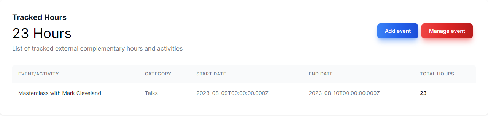

# College-hour-tracker


College Hour Tracker is an application dedicated to the tracking of college complementary activities and events

## Folder Structure
```
src
    ├───backend
    │   ├───prisma
    │   │   └───... (prisma files)
    │   ├───src
    │   │   └───... (nest source files and entities)
    │   └───test ...(test files)
    └───frontend
        ├───public
        └───src
            ├───app
            │   └───... (nextjs pages)
            └───services (communication with backend)
                └───... (axios services)
```

## Technology Stack
### Backend
- [NestJS](https://nestjs.com/)
- [Prisma](https://www.prisma.io/)
- [PostgreSQL](https://www.postgresql.org/)
- [Swagger](https://swagger.io/)

### Frontend
- [NextJS](https://nextjs.org/)
- [ReactJS](https://reactjs.org/)
- [TypeScript](https://www.typescriptlang.org/)
- [TailwindCSS](https://tailwindcss.com/)
- [Axios](https://axios-http.com/)

## Demonstration Video
Drive video: https://drive.google.com/file/d/15AojJqANK0aD0my29mEb6so5uf6mwXyE/view?usp=sharing

## Installation
1. Clone the repository `git clone https://github.com/gabriosilva/college-hour-tracker`
2. `cd ./college-hour-tracker`

### 1. Backend

1. Go to the backend folder `cd ./src/backend`
2. Run `npm install`
3. Copy the .env template file `cp ./.env.template ./.env`
4. Modify `DATABASE_URL` env var according to your database settings
5. Run `npm run start:dev`
6. The API must be running on `http://localhost:3001`
7. Swagger documentation can be accessed at `http://localhost:3001/api`

### 2. Frontend

1. Go to the frontend folder `cd ./src/frontend`
2. Run `npm install`
3. Copy the .env.local template file `cp ./.env.local.template ./.env.local`
4. Modify `NEXT_PUBLIC_BASE_API` according to your backend API address
5. Run `npm run dev`
6. The application must be running on `http://localhost:3000`
####

## Contributing

Pull requests are welcome. For major changes, please open an issue first
to discuss what you would like to change.

Please make sure to update tests as appropriate.

## License

[MIT](https://choosealicense.com/licenses/mit/)